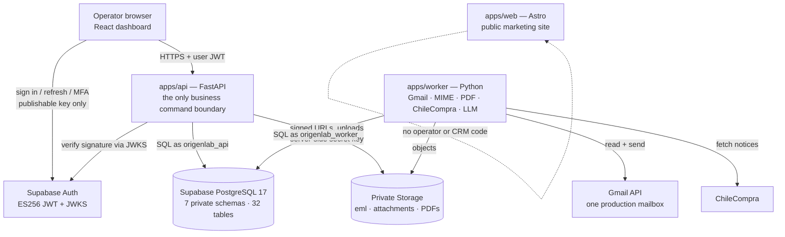
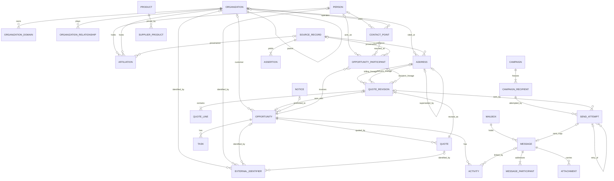
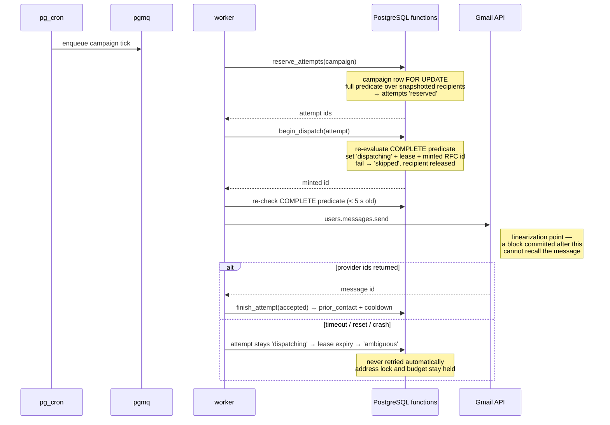

# OrigenLab V2 — architecture

**Purpose.** How the system is built, how it is secured, and where each
responsibility lives.

**This document owns:** the topology; the FastAPI command boundary; dashboard,
web and worker responsibilities; the seven private schemas; the one-writer
rules; Supabase Auth and JWKS verification; database roles, grants, RLS, the
`SECURITY DEFINER` doctrine and the `service_role` boundary;
private Storage; Queues and Cron; worker deployment; observability; the
independent Storage backup; the diagrams; and the external CRM benchmark
conclusions.

**It does not own:** what the tables mean ([`DOMAIN.md`](DOMAIN.md)), who owns
which fact ([`DATA.md`](DATA.md)), the transitions
([`WORKFLOWS.md`](WORKFLOWS.md)), the cutover ([`MIGRATION.md`](MIGRATION.md)),
the runbooks ([`OPERATIONS.md`](OPERATIONS.md)).

Everything here is **[V2 DECISION]** and **[PLANNED]**. No Supabase project,
schema, role, bucket or table exists yet.

## 1. Topology

**The dashboard never connects to PostgreSQL.** Every data path is FastAPI
with the operator's JWT.

## 2. Responsibilities

| Component | Owns | Never does |
|---|---|---|
| `apps/web` (Astro, static) | the public marketing site | touch operator, CRM or outbound data |
| `apps/dashboard` (React) | presentation, operator interaction | hold truth, compute money, call the database, hold a secret |
| `apps/api` (FastAPI) | **the only business command boundary**: authentication checks, validation, idempotency, transactions, domain events, signed-URL minting | ingest mail, call Gmail, render PDFs, run long jobs |
| `apps/worker` (Python) | Gmail sync and the single send path, MIME parsing, PDF rendering, ChileCompra fetching, LLM classification, reconciliation | write `crm.*` — except `quote_revision.pdf_sha256` and sent-evidence ids, and only through `crm.record_quote_pdf` ([§6.2](#m-arch-definer)) |
| PostgreSQL | every durable fact; the closed list of privileged send functions; the constraints that make the invariants true | store bodies, attachments or PDFs; hold a browser identity; authorize a human |
| Storage | `.eml`, attachment bytes, quotation PDFs, dry-run reports | be public; be the authority for a fact |

## 3. Schemas and tables

Seven **private** schemas — `crm`, `comms`, `outbound`, `evidence`, `catalog`,
`procurement`, `platform` — holding **32 application tables** (`crm` 16,
`comms` 4, `outbound` 5, `evidence` 2, `catalog` 2, `procurement` 1,
`platform` 2), the current reviewed foundation. The inventory, with each
table's unique responsibility, is owned by [`DOMAIN.md`](DOMAIN.md) §7.

`public` holds nothing. Supabase-managed `auth`, `storage`, `pgmq` and
migration-metadata objects are outside the 32 and are not application tables.

### 3.1 One-writer rules

| Table group | Sole writer |
|---|---|
| `crm.*` (except the two quote columns below) | FastAPI commands as `origenlab_api` |
| `crm.quote_revision.pdf_sha256`, sent-evidence ids | the worker, through `crm.record_quote_pdf` — one privileged function, those columns only ([§6.2](#m-arch-definer)) |
| `comms.*` | the worker's Gmail sync; FastAPI only for participant resolution |
| `outbound.send_attempt`, `outbound.contact_control` | the send/reconcile functions, the NDR handlers, the Wave 1A loader, admin commands — **never direct DML from a runtime role** |
| `outbound.send_control` | one admin function |
| `outbound.campaign`, `campaign_recipient` | FastAPI for lifecycle and freeze; the send functions for recipient state |
| `evidence.*`, `catalog.*`, `procurement.*` | the worker and loaders; FastAPI for operator resolution |
| `platform.*` | FastAPI |
| `crm.domain_event` | every command and function — **INSERT only; no UPDATE, no DELETE grant exists** |

No table has a second writer. There is no ad-hoc SQL path against a durable
table.

## 4. The FastAPI command boundary

- Every mutation is a `POST` command with a trusted operator identity, an
  `Idempotency-Key` recorded in `platform.command_receipt`, and — where
  concurrent edits are possible — an `expected_version`.
- One command is one database transaction, and every transaction that changes
  state writes exactly one `crm.domain_event`.
- Reads are ordinary SQL views ([`DATA.md`](DATA.md) §9).
- FastAPI never calls Gmail, never renders a PDF, and never runs a long job.
  It enqueues work ([§8](#m-arch-queues)).

## 5. Authentication and authorization

**Supabase Auth establishes identity. FastAPI authorizes.**

1. Supabase Auth issues **ES256 (asymmetric) JWTs**. Sign-ups are disabled;
   operators are invited by an admin command that also inserts
   `platform.operator`.
2. The dashboard holds only the **publishable key**, and uses it only for sign
   in, refresh and MFA.
3. FastAPI verifies signature, `iss`, `aud` and `exp` against the project's
   **JWKS endpoint**, cached and refetched once on an unknown `kid`. No legacy
   shared JWT secret.
4. FastAPI then loads `platform.operator` by `sub`: `role ∈ {admin, sales,
   viewer}` and `status ∈ {active, disabled}`, cached in-process for at most
   60 seconds **(impl)**. **Sensitive commands** — send control, approvals,
   block revocation, ambiguous resolution, merges, operator management — read
   the operator row **inside the command transaction**, bypassing the cache.
5. Admin commands additionally require `aal = 'aal2'` in the JWT.

**No custom access-token hook is required for V2.** Hook claims are computed
at issuance and go stale until the next refresh; reading `platform.operator`
live is correct and simpler.

## 6. Database roles, grants and RLS

**[V2 DECISION]** — and this is the part most easily got wrong, so it is
stated exactly.

| Role | Attributes | Purpose |
|---|---|---|
| `origenlab_owner` | **`NOLOGIN`**, `NOSUPERUSER`, `NOBYPASSRLS`; **owns every application object**, including every privileged function | an ownership identity only. Nothing ever connects as it |
| `origenlab_migrator` | LOGIN, **`NOINHERIT`**, `NOSUPERUSER`, `NOBYPASSRLS`, member of `origenlab_owner` | DDL and data-fixing migrations, run under an explicit `SET ROLE origenlab_owner`. Never serves a request |
| `origenlab_api` | LOGIN, `NOSUPERUSER`, **`NOBYPASSRLS`**, `NOCREATEDB`, `NOCREATEROLE`; **not a member of `origenlab_owner`** | FastAPI runtime |
| `origenlab_worker` | LOGIN, `NOSUPERUSER`, **`NOBYPASSRLS`**, `NOCREATEDB`, `NOCREATEROLE`; **not a member of `origenlab_owner`** | worker runtime |
| `postgres` | Supabase-managed platform / control-plane identity — **not an OrigenLab role** | never used by any OrigenLab runtime process |
| `anon`, `authenticated` | Supabase-managed; `NOBYPASSRLS` | **no grants at all** on the seven schemas: `USAGE` on those schemas is revoked, and `EXECUTE` is revoked on every application function |
| `service_role` | Supabase-managed; **retains its platform-defined `BYPASSRLS` attribute** — not an OrigenLab role and outside the OrigenLab trust boundary | never used by OrigenLab application code. Held out by revoked grants and unexposed schemas, **not** by RLS ([§6.4](#m-arch-service-role)) |

**No OrigenLab-created role is granted `BYPASSRLS`** — `origenlab_owner`,
`origenlab_migrator`, `origenlab_api` and `origenlab_worker` are all
`NOBYPASSRLS`, not now and not as a convenience later. **No OrigenLab runtime
process connects as `postgres`, `service_role` or any other Supabase
administrative role**; those are platform / control-plane identities, not
application runtime roles. Supabase's managed `service_role` keeps its
platform-defined `BYPASSRLS` attribute — this design neither claims otherwise
nor proposes altering or removing it, and contains it by the grant and
schema-exposure boundary of [§6.4](#m-arch-service-role) instead.

**A runtime role can neither inherit nor `SET ROLE` to `origenlab_owner`**;
only the migrator may assume it, and only to run DDL. Neither runtime role is
a member of `origenlab_owner` or of the other runtime role, and **neither the
API nor the worker ever issues `SET ROLE`**.

**(impl)** The Supabase CLI applies `supabase/roles.sql` and every migration as
the platform `postgres` login, which is not a superuser and holds `ADMIN OPTION`
on every role it creates. `roles.sql` therefore grants `postgres` the same
SET-only, non-inheriting membership in `origenlab_owner` that the migrator
holds, so `set role origenlab_owner` inside a migration succeeds. `postgres`
remains a control-plane identity: never a runtime role, never a login for any
OrigenLab process. Because a non-superuser may not mention `SUPERUSER`,
`BYPASSRLS` or `REPLICATION` in `ALTER ROLE`, `roles.sql` sets those attributes
only at `CREATE ROLE` and asserts them fail-closed on every run.

### 6.1 How grants, RLS and privileged functions divide the work

Three layers do three different jobs and are never substituted for one
another:

| Layer | Protects | Mechanism | Executes as |
|---|---|---|---|
| **A — ordinary table operations** | almost everything either runtime role does | per-table, per-verb `GRANT`s, database constraints, and an explicit named RLS policy per role per table | the runtime role itself, `SECURITY INVOKER` |
| **B — narrowly scoped privileged commands** | the handful of writes a caller must be unable to make directly | the closed list of `SECURITY DEFINER` functions in [§6.2](#m-arch-definer) | `origenlab_owner`, deliberately outside the caller's RLS |
| **C — operator (user-level) authorization** | which human may issue which command | FastAPI, against the verified JWT and `platform.operator` (§5) | not in the database at all |

Layer A is the default and carries the overwhelming majority of writes. Layer
B is an exception list, not a pattern. Layer C never reaches the database: **a
database session is a server role, never a person**, so no application
function consults `auth.uid()`, `auth.jwt()` or any browser identity — FastAPI
has already authorized the operator and passes only validated command context
as ordinary arguments.

How the database-side mechanisms interact — precisely:

1. **RLS is `ENABLE`d on all 32 tables** and is **not** `FORCE`d. Because the
   application tables are deliberately not `FORCE ROW LEVEL SECURITY`, the
   object owner (`origenlab_owner`) crosses RLS by virtue of owning them. That
   ownership exemption is what makes migrations workable and what gives layer
   B its power; it is **the only application-owned RLS exemption** in the
   design, and it belongs to a role nothing can log in as. It is not the only
   identity in the cluster that can cross RLS — Supabase's managed
   `service_role` carries `BYPASSRLS` from the platform — but that role sits
   outside the OrigenLab trust boundary and is held out by grants and schema
   exposure, never by a policy ([§6.4](#m-arch-service-role)).
2. **Both runtime roles lack `BYPASSRLS`, so RLS does apply to them.** Each
   table a runtime role may touch carries an **explicit named policy** for
   that role. A table with no policy for a role is unreachable by that role —
   so a table added by a future migration is deny-by-default until someone
   deliberately opens it.
3. **Grants are the primary least-privilege mechanism**, per table and per
   verb. There is no `GRANT ALL ON ALL TABLES IN SCHEMA`. `origenlab_api`
   holds DML on `crm.*`, `platform.*` and campaign lifecycle tables plus SELECT
   elsewhere; `origenlab_worker` holds DML on `comms.*`, `evidence.*`,
   `procurement.*` and `catalog.*` plus SELECT elsewhere.
4. **A permission error or an empty RLS result is fixed by the missing grant
   or the missing policy** — never by widening a role and never by wrapping
   the statement in a definer function ([§6.2](#m-arch-definer)).
5. **What RLS is actually buying here, stated honestly:** it is a
   deny-by-default backstop, not the authorization model. Authorization is
   grants (layer A), the closed definer list (layer B), and FastAPI's operator
   checks (layer C). Row-level predicates are meaningful only where a row
   belongs to one operator; elsewhere the policy is a role gate. If the Data
   API were ever switched on by accident, RLS would still stop `anon` and
   `authenticated`, which are `NOBYPASSRLS` — but it would **not** stop
   `service_role`, which is not. What holds `service_role` out is the revoked
   schema `USAGE` and the revoked object and `EXECUTE` privileges of
   [§6.4](#m-arch-service-role), because bypassing RLS does not bypass an
   ordinary object grant. RLS also does **not** protect the writes performed
   inside a definer function ([§6.2](#m-arch-definer)).
6. **The Data API (PostgREST) is off** and the application schemas are never
   added to the exposed-schema list. Turning it on is a decision, not a
   default.

### 6.2 Privileged functions — the `SECURITY DEFINER` doctrine

**`SECURITY INVOKER` is the default.** Every function, view and trigger in the
seven schemas is `SECURITY INVOKER` unless it appears in the closed list
below. Read-side helpers — `outbound.dispatch_allowed`
([`WORKFLOWS.md`](WORKFLOWS.md) §2), the `crm.domain_event` payload validator
and the quote-totals check trigger ([`DATA.md`](DATA.md) §1.1) — are
`SECURITY INVOKER` and stay fully subject to the caller's grants and RLS.

**`SECURITY DEFINER` is never introduced to make a permission error or an RLS
error go away.** It is allowed only where a **narrowly scoped atomic command
must write tables that its callers intentionally cannot modify directly** — in
this system, the critical outbound state transitions and the two
worker-written quote columns. Nothing else qualifies, and the list is closed:

| Function (private schema) | Writes | `EXECUTE` granted to |
|---|---|---|
| `outbound.reserve_attempts(campaign_id)` | `send_attempt`, `campaign_recipient` | `origenlab_worker` |
| `outbound.begin_dispatch(attempt_id)` | `send_attempt`, `campaign_recipient` | `origenlab_worker` |
| `outbound.finish_attempt(attempt_id, outcome, provider_ids, reason)` | `send_attempt`, `contact_control`, `campaign_recipient` | `origenlab_worker` |
| `outbound.resolve_ambiguous(attempt_id, verdict, reason)` | the resolution fields of one `send_attempt` | `origenlab_api` |
| `outbound.authorize_retry(attempt_id, reason)` | one new `send_attempt` | `origenlab_api` |
| `outbound.set_send_control(flag, value, reason)` | `send_control` | `origenlab_api` |
| `outbound.add_contact_control(kind, purpose, normalized_address, reason, …)` | `contact_control` | `origenlab_api` (admin block and revoke) **and** `origenlab_worker` (hard bounce, complaint, unsubscribe) |
| `crm.record_quote_pdf(revision_id, pdf_sha256, sent_evidence_ids)` | only `quote_revision.pdf_sha256` and the sent-evidence ids | `origenlab_worker` |

Each writes exactly one `crm.domain_event`. Every one of them satisfies all of
the following, and a proposed definer function that misses any line is
rejected:

1. It lives in one of the seven **private, never-exposed** schemas. **A
   definer function is never created in `public`** — `public` holds nothing
   (§3) and is not on the exposed-schema list either way.
2. It is **owned by `origenlab_owner`**, the `NOLOGIN` owner role — never by a
   runtime login and never by `postgres`. That ownership, not `BYPASSRLS`, is
   what lets the function write past the caller's policies.
3. It pins a **fixed, safe `search_path`** on the function itself
   (`SET search_path = pg_catalog`): no `public`, no `$user`, never the
   session's value.
4. **Every referenced object is schema-qualified** — in the body, and in the
   argument and return types.
5. It contains **no uncontrolled dynamic SQL.** Static statements only; where
   a statement must be assembled, every identifier comes from a fixed literal
   list in the function, never from an argument.
6. `EXECUTE` is **revoked from `PUBLIC`, `anon`, `authenticated` and
   `service_role`** in the same migration that creates it — PostgreSQL grants
   `EXECUTE` to `PUBLIC` by default — and granted **only** to the specific
   role named in the table above. The matching `ALTER DEFAULT PRIVILEGES` for
   objects created by `origenlab_owner` ([§6.4](#m-arch-service-role)) is what
   keeps a later function from silently regaining that access.
7. It **validates its arguments and asserts its calling login** before
   writing. **The `EXECUTE` privilege is the primary authorization
   boundary**; the login assertion is defence in depth. That assertion is made
   on **`session_user`**, never on `current_user`: during `SECURITY DEFINER`
   execution `current_user`, `current_role` and `user` are the effective
   function owner — expected to be `origenlab_owner` — and **do not identify
   the invoking runtime login**. Because a privileged application function may
   be invoked only over a **direct database connection**, `session_user` is
   the authenticated database login and is asserted against the exact
   permitted role: the two roles named in the table above for
   `outbound.add_contact_control`, and exactly the one documented grantee for
   every other function. The function then checks every argument for
   existence, current state, enum membership and row ownership. It is **never
   callable through PostgREST / the Data API**, and it never substitutes
   `auth.uid()` or `auth.jwt()` for the direct database login (§6.1, layer C).
8. It **exposes the smallest possible operation**: one state transition on one
   aggregate. No general-purpose update surface, no free-form predicate or
   SQL fragment argument, no "and also do X" flag.
9. It is covered by three kinds of test: **authorization** (the wrong runtime
   role, `anon`, `authenticated`, `service_role` and `PUBLIC` are all refused
   — by the absent `EXECUTE` grant first, and by the `session_user` assertion
   for any role that does hold `EXECUTE` but is not a permitted caller),
   **RLS bypass** (the function touches only its declared tables and columns,
   and the calling role still cannot reach those tables directly), and **state
   transition** (every legal transition, every rejected one, and the
   concurrent cases). The authorization tests connect **directly as the
   runtime login under test**, and one of them demonstrates the definer
   semantics themselves: inside the call, `current_user` is `origenlab_owner`
   while `session_user` is the direct runtime login. That demonstration uses a
   **transactional or migration-test fixture that is rolled back** — no
   permanent diagnostic function is created for it.
10. It is cleared by the **Supabase and PostgreSQL security advisors** —
    definer-function, mutable-`search_path` and schema-exposure checks —
    before it reaches production ([`MIGRATION.md`](MIGRATION.md) §5 slice 0,
    [`OPERATIONS.md`](OPERATIONS.md) §4).

**What this deliberately does not claim.** Inside a definer function the
caller's RLS policies **do not apply** — crossing that boundary is the entire
point of the mechanism, and no part of this design pretends otherwise. The
function *is* the boundary: its caller check, its argument validation, its
single narrow operation and its tests are the whole of the protection on the
rows it writes. That is why the list above is short, closed, and reviewed
line by line rather than extended for convenience.

### 6.3 Connections

FastAPI and the worker are persistent processes and use pooled connections.
**(impl)** the session pooler (port 5432, IPv4, `role.<projectref>` username)
supports prepared statements and long transactions and is the starting
choice; transaction mode is not used; the direct connection with an IPv4
add-on is the fallback. **Pooler versus direct connection is an implementation
detail that must be verified live against the project before deployment** —
neither is a decision this document freezes. Migrations connect as
`origenlab_migrator` and run their DDL under an explicit
`SET ROLE origenlab_owner` ([§6](#m-arch-roles)).

### 6.4 The `service_role` and platform-role boundary

`postgres` and `service_role` are **Supabase-managed platform and
control-plane identities, not OrigenLab application roles**. `service_role`
carries `BYPASSRLS` as a platform-defined attribute. This design does not
alter it, does not remove it, and does not rely on RLS to contain it.

What contains it is an independent boundary that must hold on its own:

1. **OrigenLab application code never uses a Supabase secret key or a legacy
   service-role key for application data.** FastAPI and the worker reach
   application data only over **direct PostgreSQL connections authenticated
   as their own dedicated custom `LOGIN` roles** (`origenlab_api`,
   `origenlab_worker`). Server-side API and worker components may hold a
   current Supabase **`sb_secret_...`** key and use it **exclusively to call
   the Storage API** (§7). That is a rule of use, not a property of the key:
   an `sb_secret_...` key is **not intrinsically Storage-scoped** — it
   resolves to `service_role` and bypasses RLS wherever it is presented. The
   isolation of application data from that key therefore rests entirely on
   the unexposed application schemas, the revoked grants, the revoked
   `EXECUTE` and the controlled default privileges of points 3–5, never on the
   key's nature. The dashboard, `apps/web`, every browser bundle and source
   control never receive it. Legacy JWT-format `service_role` keys are **not
   selected** for the new implementation; where the API and the worker both
   need Storage, each holds its **own, separately rotatable** secret key.
2. **The browser receives only the publishable key**, and only for Supabase
   Auth sign-in, refresh and MFA (§5).
3. **The seven application schemas are private and are not exposed through the
   Data API** (§6.1, point 6). A privileged application function is therefore
   never reachable through PostgREST.
4. **Schema `USAGE` and every object privilege are revoked from `PUBLIC`,
   `anon`, `authenticated` and `service_role`** on all seven application
   schemas, and **`EXECUTE` is revoked from those same roles on every
   application function** — unless an explicit future architecture decision
   says otherwise.
5. **`ALTER DEFAULT PRIVILEGES` for objects created by `origenlab_owner`
   matches those revocations**, so a table, sequence or function added by a
   later migration does not silently regain access.

**Bypassing RLS is not bypassing a grant.** A role holding `BYPASSRLS` still
needs `USAGE` on the schema and a privilege on the object; without them the
statement fails before any policy would have been consulted. The grant and
exposure boundary above is therefore **mandatory and independent**, not
belt-and-braces — and `service_role` is never described as safe merely because
a policy exists or because grants were revoked in one migration. Both the
revocations and their default privileges are audited on every migration
([`OPERATIONS.md`](OPERATIONS.md) §4).

## 7. Storage

- **All buckets are private. There are zero storage policies and zero public
  paths.**
- FastAPI and the worker reach Storage with a current **`sb_secret_...`** key
  from server environment only, and use it **only for the Storage API**. That
  is a use restriction, not a scope: the key resolves to `service_role`,
  bypasses RLS, and is kept away from application data solely by the
  unexposed schemas, revoked grants, revoked `EXECUTE` and default privileges
  of [§6.4](#m-arch-service-role). The API and the worker hold separate,
  separately rotatable keys; legacy JWT `service_role` keys are not used.
  **A secret key never reaches the dashboard, `apps/web`, a browser bundle or
  source control**, and never appears in these documents.
- A browser receives a **signed URL valid for at most 10 minutes**, minted
  only after FastAPI has authorized that specific operator for that specific
  object. Uploads go through FastAPI.
- S3 access keys are not issued.
- **Database backups do not include Storage objects.** Buckets are therefore
  backed up **independently**, to separate storage, with their own manifest
  and hashes, and the restore drill covers a bucket restore
  ([`OPERATIONS.md`](OPERATIONS.md)).

## 8. Queues, cron and worker deployment

- **`pgmq` queues** carry work from FastAPI to the worker: render a PDF, sync a
  mailbox, fetch notices, reconcile attempts, dispatch a reserved attempt.
- **`pg_cron`** schedules recurring jobs by enqueueing onto those queues: Gmail
  sync, ChileCompra refresh, the reconciler, the Storage backup job, the
  cooldown sweep.
- **The worker is a long-running process** on a container host, one replica for
  the send path. Its concurrency is bounded by the queue, and the one-open-
  attempt index makes a second replica safe but unnecessary.
- **Heavy worker jobs never run as Edge Functions.** Edge Functions are not on
  any critical path — not sending, not ingesting, not rendering, not
  reconciling. IMAP/Gmail sync, MIME parsing, PDF rendering and LLM calls all
  exceed what that runtime should carry.
- **There is no SQLite tier, no mirror, no mart and no projection table in
  V2.**

## 9. Observability

| Signal | Source |
|---|---|
| Every state transition | `crm.domain_event` — the primary audit and the primary debugging tool |
| Send safety | `outbound.send_attempt` counts by `submission_state` and `delivery_state`; open attempts older than the lease |
| Queue health | `pgmq` depth and oldest-message age per queue |
| Sync health | `comms.mailbox` cursor age |
| Application logs | structured JSON from FastAPI and the worker, with a correlation id per command and per attempt |
| Alerts | see [`OPERATIONS.md`](OPERATIONS.md) |

Nothing is observed by reading a projection table, because there are none.

## 10. Entity relationships

`outbound.send_control` and `outbound.contact_control` are deliberately absent
from the diagram: `send_control` is a single global row, and `contact_control`
is keyed by **normalized text, not by a foreign key**, so a safety fact
survives every identity merge and covers addresses that were never contact
points ([`DATA.md`](DATA.md) §3). The `QUOTE_REVISION` edges from `ADDRESS`
and `OPPORTUNITY_PARTICIPANT` are lineage only: an issued revision renders
from its own party snapshot ([`WORKFLOWS.md`](WORKFLOWS.md) §W3b).

## 11. The send path

The predicate, its three enforcement points and the honest statement of the
race window are owned by [`WORKFLOWS.md`](WORKFLOWS.md) §2.

## 12. Deliberate absences

| Not in V2 | Why |
|---|---|
| Data API / PostgREST exposure | every path is FastAPI with the user's JWT |
| Edge Functions on any critical path | the work is too heavy and too stateful |
| A SQLite runtime tier, mirror, mart or projection table | one database, one truth, views for everything else |
| A second database, an event bus, a generic workflow engine, microservices | the product does not need them |
| `BYPASSRLS` on any **OrigenLab-created** role | least-privilege grants and RLS, plus a closed list of narrowly scoped `SECURITY DEFINER` functions owned by a `NOLOGIN` role ([§6.2](#m-arch-definer)). Supabase's managed `service_role` keeps its platform `BYPASSRLS`; it is held out by revoked grants and unexposed schemas ([§6.4](#m-arch-service-role)) |
| `current_user` as the caller check inside a `SECURITY DEFINER` function | inside a definer call `current_user` is the owner, not the invoker; `EXECUTE` is the boundary and the login assertion is on `session_user` ([§6.2](#m-arch-definer)) |
| A Supabase secret or legacy service-role key as an application-data credential | direct PostgreSQL connections as `origenlab_api` / `origenlab_worker`; a current `sb_secret_...` key is permitted server-side for the Storage API only — a use restriction, because the key itself resolves to `service_role` and is not Storage-scoped ([§6.4](#m-arch-service-role), §7); legacy JWT `service_role` keys are not selected |
| `SET ROLE` from the API or the worker | only `origenlab_migrator` may `SET ROLE origenlab_owner`, and only for DDL ([§6](#m-arch-roles)) |
| `SECURITY DEFINER` as a cure for a permission or RLS error | the fix is the missing grant or the missing policy; the definer list is closed |
| A definer function in `public`, or one owned by a runtime login | private schemas only, `origenlab_owner` only |
| `auth.uid()` inside an application function | the database session is a server role; FastAPI authorizes the operator and passes validated arguments |
| A break-glass sender or any second send path | one sender path ([`WORKFLOWS.md`](WORKFLOWS.md) §2) |
| A browser-held database or secret key | the dashboard holds only the publishable key |
| A shared package | none until two consumers actually exist |

## 13. External CRM benchmark — conclusions

Reviewed 2026-09-05 (Documentation Slice D0.3) against current official
sources: Odoo 19 (`res.partner`, `sale.order`, `mail.blacklist` and
`mailing.subscription` in the `odoo/odoo` 19.0 tree), ERPNext / Frappe (the
`Address`, `Contact`, `Opportunity` and `Quotation` doctypes and the address
manual), SuiteCRM (`AOS_Quotes` vardefs and module documentation), Twenty
(data-model and field-type documentation), Salesforce (the object and field
reference for `OpportunityContactRole`, `Quote`, `Individual`,
`ContactPointConsent` and `DataUsePurpose`) and HubSpot (Associations v4 and
subscription-type documentation). The purpose was to extract stable concepts,
not to import a schema; per [`README.md`](README.md), nothing is copied
mechanically.

| Concept | What the benchmark shows | OrigenLab decision |
|---|---|---|
| Address as an entity | Odoo: one `res.partner` row is person, company and address at once, typed `contact` / `invoice` / `delivery` / `other` under `parent_id`. ERPNext: a separate `Address` doctype — structured fields, closed `address_type`, `disabled` to retain history — linked to parties by a generic `Dynamic Link` (`link_doctype`, `link_name`). Salesforce, HubSpot, SuiteCRM, Twenty: compound fields or columns on the account / company, not records | a separate `crm.address` with structured fields and supersession (ERPNext's stable ideas), bound to `crm.organization` by a typed FK — the generic link and the combined partner row both rejected — [`DOMAIN.md`](DOMAIN.md) §2.8 |
| Structured versus formatted address | every system stores components — street lines, city, state / region, postal code, country; ERPNext renders `address_display` from a per-country template | structured fields are canonical; formatted text is derived per `country_code` at render time; `locality` / `administrative_area` hold comuna / región for Chile and city / state elsewhere |
| People on an opportunity | Salesforce `OpportunityContactRole` (`ContactId`, `Role`, `IsPrimary`, at most one primary) and HubSpot labelled contact ↔ deal associations (several labels per pair) are many-to-many with roles. ERPNext (`contact_person`), Twenty (`pointOfContact`) and Odoo (`partner_id`) hold one contact per deal — a limitation their users ask to lift | `crm.opportunity_participant`: many participants, closed `role`, one current primary per role, validity — typed FKs rather than a generic junction or label table. The single `person_id` / `contact_point_id` on the opportunity is removed — [`DOMAIN.md`](DOMAIN.md) §3.3 |
| Participant before resolution | Odoo `crm.lead` carries `contact_name`, `partner_name` and `email_from` as text until conversion creates a partner | a participant may be a contact point alone and gain `person_id` later; no text-only party fields on the opportunity and no lead table |
| Party values on an issued document | Salesforce `Quote` owns `BillingAddress`, `ShippingAddress`, `QuoteToAddress`, `ExpirationDate`; SuiteCRM `AOS_Quotes` stores `billing_address_*` / `shipping_address_*` columns filled from the account; ERPNext `Quotation` keeps the link **and** the rendered value (`customer_address` + `address_display`, `contact_person` + `contact_display` / `contact_email`) plus `valid_till`, `currency`, `conversion_rate`, `payment_terms_template`. Odoo `sale.order` keeps only live `partner_invoice_id` / `partner_shipping_id` references, so a partner edit changes how an issued order renders | a validated, versioned `party_snapshot` on `crm.quote_revision`, frozen at approval, plus nullable typed lineage FKs — the link-plus-value pattern generalized, the live-reference pattern rejected; no snapshot table — [`WORKFLOWS.md`](WORKFLOWS.md) §W3b |
| Global block versus purpose opt-out | Odoo separates `mail.blacklist` (global, `unique (email)`) from `mailing.subscription.opt_out` (per list); HubSpot separates global unsubscribe / bounce suppression from per-subscription-type status, and transactional email ignores subscription status but not suppression; Salesforce scopes `ContactPointConsent` by `DataUsePurpose`; ERPNext has one `unsubscribed` flag | one `outbound.contact_control` with a `purpose` discriminator (`all`, `marketing`) and explicit applicability rules in the send predicate; transactional sends obey `purpose = all` blocks and ignore marketing-only rules. No consent framework, no second table — [`WORKFLOWS.md`](WORKFLOWS.md) §1.6, §2 |
| Extensibility | Salesforce, HubSpot, Twenty and Frappe offer custom objects and custom fields as a platform feature | not adopted: a new role, scheme or subject is a migration extending a CHECK or adding a typed FK ([`DOMAIN.md`](DOMAIN.md) §2.6) |

**Not imported, deliberately:** Odoo's combined person / company / address
record and its `commercial_partner_id` derivation; Frappe's `Dynamic Link` or
any `parent_type` / `parent_id` association; a metadata-driven custom-object
engine or arbitrary custom fields; pricebooks, warehouses, inventory, invoices
and accounting; a lead table or lead conversion; a second email history or
suppression authority; association-label tables. The inventory after this
review is 32 tables ([`DOMAIN.md`](DOMAIN.md) §7) — the current reviewed
foundation, not a permanent budget.
