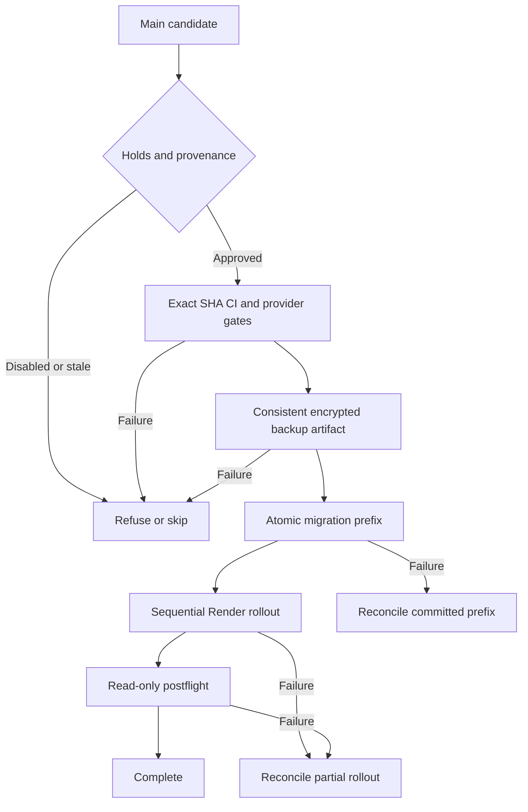

# OrigenLab production release: independent engineering audit and runbook

**2026-10-08 — PR #679. Unattended activation: BLOCKED pending approved cutover/recovery.** The implementation can
be reviewed and merged with both automation variables OFF and the four independent
Render deploy triggers OFF. A merge is not permission to activate or deploy. No
production mutation, merge, Gmail send, queue replay or deletion was performed in this
audit. The manually approved public website deployment was not modified.

Policy belongs to [OPERATIONS §15](../OPERATIONS.md#15-production-release-contract-pr-679-built-activation-blocked).
This reference records the implementation, evidence, limits and operator procedure.

## Independent engineering audit, 2026-10-08

Reviewed the actual branch, PostgreSQL catalog/aggregates, provider service/deploy/log
responses, main ruleset, workflow job results and decoded CI logs. PR prose was not
accepted as evidence. Source code commits added during review:

- `a2a47976`: executable atomic migration and consistent encrypted backup tests.
- `75ffa2f8`: event/review/CI provenance, provider reconciliation and postflight fixes.
- `ecd6efcc`: explicit installed PG17 binary selection after GitHub reproduced a failure.
- `5a5fac60`: complete migration-chain restore, actual mail eligibility and main-only environment.

Subsequent evidence/TOC updates are in this same PR. Check its final head and Actions
before merging; previous green runs do not certify a newer commit.

### Production observations and incident timeline

| Evidence | Independently observed result |
|---|---|
| Project | `txgsamojgvkymitcdcpo`, sa-east-1, ACTIVE_HEALTHY, PostgreSQL 17.6.1.166 |
| Ledger and constraint | 50 versions; head `20261007160000`; `delivery_failure` permitted |
| Migrator privilege catalog | SET owner; ledger schema USAGE and table SELECT/INSERT |
| Subscription | Actual organization API reports **Pro**, replacing older Free-plan notes |
| Worker | Recent heartbeat; aggregate `triage_sweep` events execute each minute |
| Queue | 7,979 historical failed jobs retained; successful jobs are intentionally deleted |
| Capture | One authorized mailbox; observed last cursor advance 2026-10-08 13:50:38 UTC |
| Final worker SQL | Healthy: heartbeat, specific sweep scheduling and no stale eligible triage/bounce/requester gaps |
| Render | All four services still `autoDeployTrigger=commit`, main; none suspended |
| Cron | `*/10 * * * *`; command runs Gmail capture **and then** Drive filing using `&&` |
| Main ruleset | Active Protect main ID 17174991: **0** required approvals, **no** required status checks |
| Public website | `.github/workflows/web-deploy.yml` unchanged; manually approved `production` environment preserved |

**Timeline correction:** migration 50 first entered main in PR **#674**, commit
`edcc28c7`, at 18:05 UTC October 7. Render's first sampled `CheckViolation` log is
18:08:14 UTC. PR #678's commit `6b4c602a` is later, 19:40:56 UTC. Thus #678 did
not originate the schema mismatch; its rollout inherited an already failing contract.
The underlying cause remains code deployment without the required database migration.
Sampled failure timestamps and error classes were reviewed without publishing error
records or email contents. The reported 7.5 MB recovery backup was **not** available
for independent decryption/restoration in this audit.

### Prioritized findings

| Severity | Finding and evidence | Disposition |
|---|---|---|
| Critical | `hosted_migrations.py` generated `end $;` instead of `end $$;`. The existing 14 tests mocked psql and never parsed the guard. | Fixed; real PG17 success/rollback tests execute the actual runner. |
| Critical | Mutable-main Render cron cannot accept `commitId`; cancellation endpoint also excludes cron. Main can move between GET and POST. A mismatched cron may already run code requiring unapplied schema. | **Closed in code by consolidated capture scheduling.** Controller never deploys cron and requires it suspended. Production cutover/verification still pending; see MAIL_WORKER_CUTOVER.md. |
| Critical | Four independent commit triggers still bypass migration ordering. | Activation/merge configuration gate; controller refuses autonomous services. Owner approval needed to turn triggers OFF. |
| High | Main ruleset permits unapproved merges with no mandatory checks. | Exact-merge independent collaborator approval and CI gates added; actual ruleset still requires owner configuration. |
| High | Ruleset API omits `bypass_actors` without write access. Original read-only gate interpreted omission as no bypass. | Local bootstrap requires visible empty bypass list; runtime independently proves approval of the exact merged PR, without adding administration credentials to Actions. |
| High | Transaction regex missed inline COMMIT, commented END, COMMIT AND CHAIN, START/ABORT/PREPARE and psql commands not at line start. | Conservative top-level SQL scanner; comments/literals cannot fake role transitions. First SET owner/last RESET required. |
| High | Lock guard compared only maximum version, allowing changes to earlier ledger rows during the race. | Exact ordered ledger prefix rechecked under the transaction advisory lock. |
| High | Dump and ledger originally read separate snapshots. | One exported repeatable-read snapshot spans both; shared advisory lock excludes cooperating DDL. |
| High | Installed client 17 did not override GitHub runner's default pg_dump. New CI failed the full backup test. | Explicit PG17 PATH in both install jobs; rerun succeeded. |
| High | Green workflow can contain skipped required jobs; workflow names alone do not prove identity. | Exact SHA/branch/repository/path and individual job checks; missing, failed, cancelled or skipped gates refuse release. All nine CI workflows now run on main. |
| High | Test and credential-bearing workflows sharing one concurrency group could block/cancel the mandatory push test while release waits for it. | Separate test groups from serialized production releases. |
| High | Protected-branches-only environment could admit another protected branch. | Setup restricts release environment to literal main branch, rejects other branch/tag policies. Public website environment untouched. |
| Medium | Scheduled backups originally started production preflight despite first-release hold. | Separate repository `OL_BACKUP_AUTOMATION_ENABLED`, default OFF. Manual plan/backup remain available. |
| Medium | Deploy/controller/worker checks needed stronger failure reconciliation. | Bounded GET retries, no blind POST retry, all-service pending-deploy precheck, per-service main/config recheck, final SHA reconciliation. |
| Medium | Heartbeat and periodic defer alone do not prove sweep execution; successful job events are deleted. | Narrow Render aggregate sweep-log check after worker deployment, plus SQL eligibility checks. No message bodies/queue arguments queried. |
| Medium | Source-less outbound bulk sends intentionally lack evidence. Treating all such records as broken processing produces 3,199 false gaps in the sampled window. | Verifier checks source-bearing mail and missing-source inbound mail; isolated SQL regression covers bulk, bounce and requester cases. Source-less outbound non-bulk loss remains indistinguishable without additional capture metadata. |
| Medium | API Render healthCheckPath is empty; `/health` returns liveness/configuration, not an authenticated DB journey. | Controller checks API HTTP liveness before dashboard. Authenticated CRM/DB smoke and provider health-check configuration remain activation/operational work. |
| Medium | A readable dump is not a restore; production roles/platform/object dependencies are outside an application dump. | Entire reviewed 50-migration schema restored in isolation with synthetic queue/data; real production-data restore still required. |
| Medium | Managed backup entitlement is not proof of an available recovery point; Storage/Drive and RTO remain unproven. | Pro confirmed; actual recovery inventory, object backup and measured recovery duration remain open. |
| Low | Major action tags can move; backup log claimed verification more strongly than proved. | Release checkout/artifact actions pinned to upstream SHAs; backup output explicitly says restoration not yet proven. |

The SQL scanner is a boundary guard for **reviewed** SQL, not a sandbox for malicious
owner-role programs. Dollar bodies stay opaque; PostgreSQL rejects their transaction
termination inside the outer transaction. Top-level ambiguous backslash literals and
psql commands are refused for manual review. A migration can still make inappropriate
business changes or override timeout/lock settings: independent review and expand/contract
compatibility are required. Existing historical admin-only migrations are not blindly
replayed by the restricted production runner.

## Release state machine



| State | Guard/effect | Durable output |
|---|---|---|
| Candidate | main must be current; workflow_run must be successful same-repo push/main; manual dispatch must also use main | Pinned full SHA |
| Hold | Missing/false release flag prevents automatic release and rejects manual release; missing/false backup flag skips schedules | Existing production stays running |
| Protection/review | Active review/check policy; exact merged PR, final-head independent collaborator approval; no direct push release | Verified provenance |
| CI | All nine named main-push workflows at exact SHA; required jobs successful; reruns select current attempt | CI evidence |
| Render preflight | Approved IDs/owner/repository/main; independent deploy OFF; legacy cron suspended; compatible consolidated entrypoint; no active deployment | No provider writes |
| Backup | TLS session pooler, migrator, PG17; one snapshot and ledger; required schemas in TOC; checksums; age encryption; successful artifact upload | Ciphertext artifact, 30-day retention |
| Migrate | Current main/CI/review/config rechecked; exact ledger prefix; 10s lock and 180s statement bounds | Each file plus ledger row committed together |
| Worker | Exact commitId, wait <=35m, refuse unknown/error statuses; no automatic rollback | Worker may be new while other services are old |
| Capture | Same pinned worker build; separate supervised process and queue; default OFF; legacy cron must be suspended | Exact-commit scheduling boundary, approved cutover pending |
| API | Exact commitId; wait live | Old dashboard still active |
| Dashboard | API `/health` success first; exact commitId; wait live | Coordinated UI revision |
| Postflight | Same live SHA on three services; candidate-SHA sweep/capture aggregates, fresh mailbox cursor, heartbeat, eligible evidence age; suspended-cron and final SHA rechecks | No writes/duplicate work |
| Complete | Final result job requires backup, migrate, deploy and verify success | Partial/skipped release cannot report complete |

The production concurrency group serializes controller runs, not human merges or Render
manual deploys. It never cancels an in-progress release automatically. New main commits
are checked before migration and each service. A change during an SQL transaction cannot
undo already committed schema; compatibility is essential. Disabling the release variable
blocks new runs/stages; it does not cancel a provider request already accepted.

## Failure and recovery matrix

| Failure | Production state | Recovery |
|---|---|---|
| Hold, unreviewed/direct push, stale SHA | No DDL/deploy | Fix provenance/configuration; use current approved main. |
| CI absent/failed/skipped or rerun pending | No DDL/deploy | Diagnose job; rerun CI, then rerun guarded workflow. Never bypass manually. |
| Backup/encryption/artifact failure | No DDL/deploy; old services live | Verify key recipient, DB permissions/tools, artifact quota; retry backup. Never assert backup verified by hand. |
| Lock contention | This migration did not run | Inspect competing session; rerun only after contention resolves. No automatic termination. |
| SQL/ledger insert failure | Current file and ledger roll back; earlier files remain committed | Fix reviewed migration or grant; inspect prefix. Roll forward. |
| Ledger drift | No guessed reconciliation | Independently investigate applied SQL/ledger, then approve a specific reconciliation. |
| Migrations succeed, worker build fails | New compatible schema, old code | Diagnose provider build; resume same SHA if still main, otherwise release newer reviewed compatible main. |
| Main moves before a pinned service POST | Worker may already be new; downstream unchanged | Controller stops. Release new current SHA through CI/migrations; no schema rollback. |
| Main moves during a service POST | Request still pins the reviewed SHA; no cron POST exists | Reconcile deployed prefix; release newer reviewed compatible main. |
| Capture overlaps during worker rollout | Verified cycle lock permits one cycle; queue period is deduplicated | Backward-compatible changes and existing mailbox/Drive idempotency; orphan jobs do not block the next period. Do not replay historical mail. |
| POST response lost or times out | Provider may have accepted deployment | Never repeat POST blindly. Read service/deploy history and actual SHA/status, then resume. |
| GET transient 429/5xx/network failure | No duplicate POST | At most three bounded reads; persistent failure stops for reconciliation. |
| Deploy times out/cancelled/unknown enum | Requested provider deploy may still be running | Inspect history. Do not assume GitHub timeout cancelled Render. No automatic cancel/rollback. |
| API rollout/readiness fails | Mail worker may be new; dashboard remains old | Diagnose API/auth/DB; deploy only compatible repaired API before dashboard. |
| Dashboard fails | New backend, prior dashboard | Maintain old-client compatibility; correct/retry dashboard. |
| Postflight fails or SHA changes while waiting | Rollout incomplete despite Render live | Inspect aggregate queue/capture/Drive/API health; fix and reverify. No customer sends or queue mutations. |
| Restore/recovery | Isolated DB includes old queue leases and flags | Keep all restored workers/senders OFF. Review queue/source timestamps, external objects, identities and send controls before approved recovery. |

Migrations are never automatically reversed. Successful services are idempotently skipped
on a rerun only when their current live commit is the exact release SHA. API HTTP liveness
is still checked before the dashboard even when the API deploy is skipped.

## Consolidated scheduler follow-up, 2026-10-08

The owner's approved implementation request closes the unpinnable cron boundary in code.
`mail-worker` supervises separate triage/capture processes; `triage-worker` is a compatible
alias. A dedicated ten-minute queue uses whole-cycle session locking, bounded retries
inside a nine-minute deadline, command timeouts, sanitized output and candidate-SHA logs.
The scheduler defaults OFF. The controller gates a suspended legacy cron and never deploys
it; only worker/API/dashboard receive exact commit IDs. Plan/backup remain read-only and
can run before cutover. No production service or flag was changed.

Real-role tests reproduced a Procrastinate 3.10 RLS-masked UniqueViolation DETAIL bug;
a narrow connector guard fixes async periodic and triage duplicate conversion without
changing grants. Tests also cover actual overlap/cancellation, orphaned doing jobs,
bounded backlog, child crashes, command kill/reaping and independent processing slots.
Both processes share the existing 512 MB / 0.5 CPU service: full workload capacity is
not proved by a process-isolation test. The cutover and additional failure/recovery matrix
are in [MAIL_WORKER_CUTOVER.md](MAIL_WORKER_CUTOVER.md).

## Tests and what they prove

Local: **30** offline release tests, **10** actual PostgreSQL 17 release/restore tests,
and the full worker suite (including new real-role scheduler tests) pass. Local PG17.11 ran
in the restricted scratch runtime with an OS-identity shim because that runtime cannot
switch users; GitHub's separate PG17.6 container independently runs these tests normally.
No production database was a test fixture. Required DB tests fail rather than silently
skip when CI's fixture/tools are missing.

Real DB cases cover success/rerun, SQL rollback, ledger-insert rollback, missing ledger
grants, advisory-lock timeout, one MVCC recovery point, full encrypted bundle checksums,
age decrypt and isolated restore, replay/dump/restore of all currently reviewed migrations
with constraints/functions/queue data, and actual verifier SQL for bulk/bounce/requester
gaps. Fixture data is synthetic. A currently reviewed migration count greater than 50 is
accepted by the test so future migrations do not deadlock the release contract.

Offline cases cover ledger prefix, owner transitions, transaction escapes, hidden ruleset
bypasses, approved-merge review identity, stale/fork/non-main events, both hold switches,
CI identity and skipped jobs, three exact-commit payloads/no cron POST, suspended-cron gate, autonomous services, bounded reads,
no blind POST retry and timestamp/resource validation of aggregate sweep events.

GitHub evidence before final head verification:

- Original head `6abed546`: six green workflows; release workflow run **37783183283**
  ran only 14 mocked offline tests. All five production stages were intentionally skipped.
- `75ffa2f8`: release run **37788000174**, isolated job **113347641523** failed the
  PG17-client selection test. Seven other DB cases succeeded; logs independently
  demonstrate real timeout/rollback execution. This failure was fixed, not ignored.
- `ecd6efcc`: release run **37788384707**, isolated job **113348956183** and offline
  job **113348956656** succeeded. Production stages were intentionally skipped.
- `5a5fac60`: **all nine workflows green**, with no unexpected skipped jobs:

| Workflow | Run ID | Verified job evidence |
|---|---|---|
| Release contract | 37789159601 | 24 offline tests; 10 isolated PG17 tests, job 113351597765 |
| API | 37789159629 | Both jobs pass; DB suite 4,378 passed / 121 explicit skips |
| Worker | 37789159627 | Both jobs pass; DB suite 452 passed / 1 explicit skip |
| Supabase | 37789159392 | 1,220 pgTAP assertions in 30 files; 352 audit unit tests; replay/bootstrap/direct-login/advisors steps pass |
| Dashboard | 37789159594 | test-build passed |
| Pipeline | 37789159324 | test passed |
| Proxy | 37789159533 | test passed |
| Web CI | 37789159807 | build passed; public deployment unchanged |
| Secret scan | 37789159639 | gitleaks passed |

Production preflight, backup, migrate, deploy, verify and result jobs were **intentionally
skipped on PR events**. Every executed step in the nine runs succeeded. Test-level skips
were independently read: API excludes 105 legacy V1/Alembic tests without their separate
DB, 1 hosted-load developer-container test, 10 empty-fixture read-boundary tests and
5 disposable TLS tests. Worker excludes 1 extension-owned-definer case because that
fixture has no such function. None was a missing V2 API/worker test DSN. These skips
are coverage limitations, not proof of those behaviors. The TLS and production-data
journey gaps remain explicitly unproven.

The final report/TOC/forward-compatible-test commit must additionally pass head CI;
exact final run IDs accompany the handoff. Prior green code runs are retained here
rather than silently attributed to a newer SHA.

Existing API/worker CI also runs real runtime-role integration suites; Supabase CI runs
migration replay, pgTAP, role/bootstrap/failure checks and advisors. Their result is
examined separately from these release tests. They do not prove live provider deploys,
actual offline recovery-key access, production restore duration or authenticated CRM UX.

## Backup recoverability and isolated restore procedure

The dump includes `crm`, `comms`, `outbound`, `evidence`, `catalog`, `procurement`,
`platform`, `procrastinate`; the ledger is a checksummed text manifest from the **same
snapshot**. It does not include global role definitions/passwords, Supabase-managed
Auth/platform services, Storage object bytes, external S3, Google Drive or the API disk.
A restore requires those dependencies from independent recovery sources.

Only ciphertext is uploaded. The private age identity stays offline, with a second
protected copy. Plaintext is temporary owner-only runner data; this is cleanup, not a
claim of physical secure erasure. Encryption/checksums establish integrity and key access
when decrypted; only actual pg_restore plus validation establishes database restoration.
GitHub retention is 30 days, not immutable offsite retention. Queue/history growth can
increase dump duration/storage; monitor backup duration, artifact bytes and restore time.

Pro is confirmed and supplies daily managed-backup entitlement. Available recovery points,
PITR settings and project-specific successful backup history were not exposed by the
connected tools and remain unverified. Existing policy is a **24-hour RPO**, daily Pro
backups required and PITR initially declined; a missed daily run breaks that RPO. RTO is
not yet measured. Object backups and tested role/credential recovery are still needed.

On an offline/trusted recovery machine, use the actual downloaded encrypted artifact:

```bash
umask 077
age -d -i /secure/offline-age-identity.txt -o snapshot.tar snapshot.tar.age
mkdir recovery-bundle
tar -tf snapshot.tar
# Inspect names before extraction; expected five fixed bundle files.
tar -xf snapshot.tar -C recovery-bundle
cd recovery-bundle
sha256sum -c SHA256SUMS.txt
pg_restore --list origenlab-production-app-schemas.dump > inspected-toc.txt
```

Create a **fresh isolated** PostgreSQL 17/Supabase-compatible target, with no worker,
networked cron or sender attached. Bootstrap approved runtime/owner roles from `roles.sql`,
install `btree_gist` in `extensions`, and grant extension USAGE. Do **not** replay the
application migrations before restoring: the dump already defines those objects.

```bash
# Set PGHOST/PGPORT/PGUSER/PGDATABASE only to the disposable recovery instance.
psql -X -v ON_ERROR_STOP=1 -f /reviewed-checkout/supabase/roles.sql
psql -X -v ON_ERROR_STOP=1 -c 'CREATE SCHEMA IF NOT EXISTS extensions; CREATE EXTENSION IF NOT EXISTS btree_gist WITH SCHEMA extensions; GRANT USAGE ON SCHEMA extensions TO origenlab_owner, origenlab_api, origenlab_worker;'
pg_restore --exit-on-error --single-transaction --dbname "$PGDATABASE" origenlab-production-app-schemas.dump
```

Then validate counts, constraints, RLS/grants, critical functions, queue tables and the
ledger manifest against reviewed files. The ledger text is **not** an executable SQL
restore; recreate/register it in the isolated target only after that comparison. Do not
point the production release runner at a restored DB and pretend it is a current ledger.
Review restored send flags without activating them. Never connect restored queue leases
or replay failed jobs automatically. Fetch/verify external objects independently, measure
elapsed recovery time and record the result. Synthetic CI restoration does not replace
this real production-data/offline-key drill.

## Short one-time procedure

1. Keep repository variables `OL_RELEASE_AUTOMATION_ENABLED=false` and
   `OL_BACKUP_AUTOMATION_ENABLED=false`. Their actual current values and protected
   Environment configuration could not be read through the connected GitHub APIs;
   the owner must confirm them before merge. No value was changed in this review.
2. Configure strict universal `gitleaks` bound to GitHub Actions integration 15368,
   at least one independent approving collaborator, stale-review dismissal, no bypass,
   and default branch main. Leave heavy **PR** checks path-filtered. All **main** CI
   is mandatory. A sole maintainer needs another collaborator; self-approval cannot
   satisfy this policy. Do not silently weaken it for convenience.
3. After explicit owner approval, run reviewed `configure_release_secrets.sh` once
   with trusted `gh`, age tools and verified CA. It installs only the main-only release
   environment, never a privileged postgres password, and never enables automation.
   Copy the private recovery identity to a second protected offline location. With
   explicit confirmation, turn the four Render auto-deploy triggers OFF without
   suspending/restarting services. Preserve public website environment approvals.
4. After final green CI and explicit merge approval, merge this PR **inactive**. Run
   manual `plan`, then `backup_only` from main. Restore that artifact into an isolated
   PG17 target using the procedure above; verify actual managed recovery points,
   objects and role/credential recovery. Manual backup requires no release flag.
5. Follow the [approved consolidated mail-worker cutover](MAIL_WORKER_CUTOVER.md):
   stage existing capture settings without deploying, suspend the legacy cron only in
   the approved handoff window, and release the pinned worker with scheduler enabled.
   The code closes the mutable-cron race; production has not completed that cutover.
6. With explicit approval, perform the first controlled release, verify candidate-SHA
   sweep/capture and cursor checks, authenticated CRM/API behavior and shared-resource
   capacity. Only then enable unattended releases and daily backup automation.
   Until approved cutover/recovery/configuration verification is complete, the verdict
   remains **BLOCKED TO ACTIVATE**.

No need to use the personal PC for subsequent normal releases once activation is proven.
No mail automation/send-control/contact-suppression changes are part of this procedure.

## Provider references and access limits

- [Render create deploy](https://api-docs.render.com/reference/create-deploy): cron
  excludes commitId; responses 201/202. Actual list rows wrap `deploy`; GET/POST deploy
  objects use `id`, `commit.id`, `status`, `finishedAt`.
- [Render cancel deploy](https://api-docs.render.com/reference/cancel-deploy): cron
  cancellation unsupported. The controller does not assume timeout means cancellation.
- [Render OpenAPI](https://api-docs.render.com/v1.0/openapi/render-public-api-1.json):
  11 status values independently checked against controller terminal/in-progress sets;
  bounded transient GET retries never retry an ambiguous POST.
- [GitHub rulesets API](https://docs.github.com/en/rest/repos/rules#get-a-repository-ruleset):
  metadata read access suffices for policy; bypass actor list requires write visibility.
- [GitHub workflow_run](https://docs.github.com/en/actions/reference/workflows-and-actions/events-that-trigger-workflows#workflow_run):
  default-branch context can obtain secrets despite an unprivileged triggering workflow;
  verified push/repository/main/SHA provenance and environment restriction are essential.
- [Supabase backups](https://supabase.com/docs/guides/platform/backups): Pro daily
  backups, seven-day retention; Storage bytes and custom-role passwords excluded.

Credentials, raw error rows, message bodies and recipient records were not published.
Gmail access was not needed to validate the deployment contract: mailbox cursor and
aggregate worker/provider metadata were sufficient. Specific CRM business-rule outcomes
and the PUCV customer's case were not changed or claimed repaired by this review.
